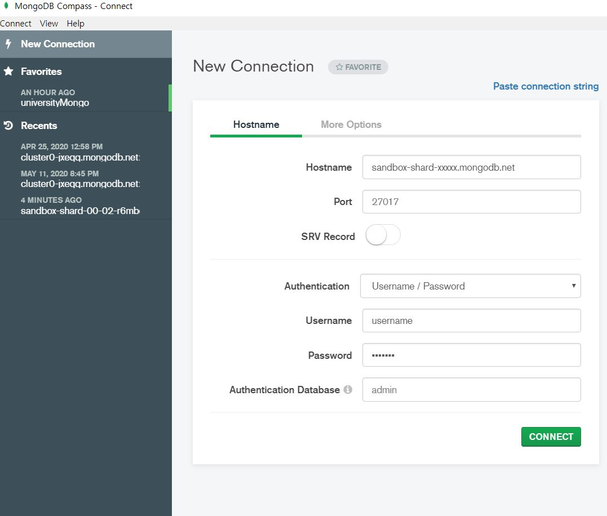

# CRUD , Connect Sandbox cluster


#### 1. CRUD

- create
- read
- update
- delete


**Loading data into your sandbox cluster** 

1. loadMovieDataset.zip(js file) download on my computer 

   location : C:\Users\jungw\M001\loadMovieDetailsDataset

2. inside this directory command to ```load('loadMovieDetailsDataset.js') ```

3. ```show dbs```  we can see Database


**Connecting to Your Sandbox Cluster from Compass**

1. copy my Sendbox Cluster Name ```sandbox-shard-xxxxxx.mongodb.net```

2.  connect Compass 

   


